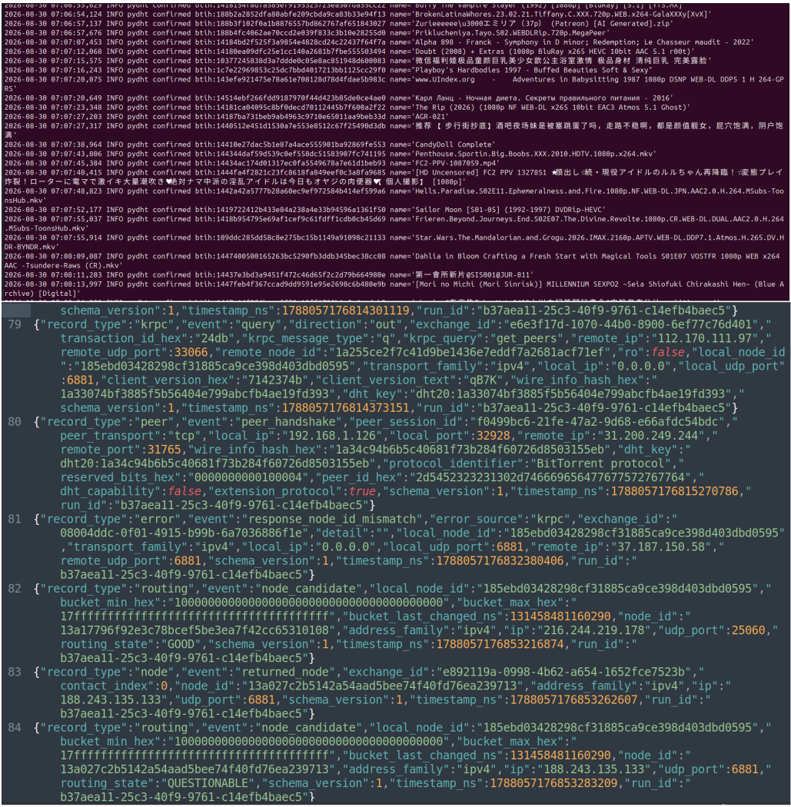

# pyDHT

**pyDHT** is a lightweight monitoring sensor for the **BitTorrent Mainline Distributed Hash Table (DHT)**.

It observes DHT activity, discovers nodes and infohashes, enriches selected observations with BitTorrent metadata, and stores the results for security monitoring and threat-intelligence analysis.

**Owner:** Denis Laskov  
**Year:** 2026  
**Language:** Python 3.12+  
**Network:** BitTorrent Mainline DHT  
**Protocols:** BEP 5, BEP 9, BEP 10, BEP 51  

---

# Part I — Executive Overview

## 1. What it is

The BitTorrent Mainline DHT is a global, decentralized network used to locate peers associated with torrent content.

**pyDHT turns that network into a security sensor.**

It gives researchers visibility into the nodes, infohashes, peers, and torrent metadata that are observable through standard BitTorrent protocols.

The goal is simple:

> See what is exposed.  
> Record what is active.  
> Identify what matters.

---

## 2. What it does

pyDHT continuously monitors existing DHT activity.

It can:

- discover DHT nodes
- observe and collect infohashes
- identify peers associated with an infohash
- retrieve torrent metadata when available
- extract torrent and file names
- detect configured keywords
- preserve DHT activity for later investigation

The primary security use cases are:

```text
Leaked data monitoring
Threat-intelligence research
Suspicious infrastructure analysis
Infohash tracking
Peer and node correlation
Historical DHT activity analysis
```

pyDHT does not download torrent payload files, execute content, or seed torrents.

It observes and records what is already visible through the network.

---

## 3. How to use it

pyDHT is **pre-configured by default** and can be started without changing the configuration.

Start the sensor:

```bash
python3 main.py
```

pyDHT will join the BitTorrent Mainline DHT, begin monitoring activity, discover nodes and infohashes, and store collected information automatically.

Sample output:



The main collected data is available in:

```text
db/dht_network.jsonl
db/pydht.sqlite3
```

Use:

- **JSONL** for DHT and network activity
- **SQLite** for discovered and validated torrent information

For custom monitoring, resource limits, keyword detection, or notification settings, edit:

```text
config.py
```

---

# Part II — Technical Reference

## 4. How it works

pyDHT runs as a node on the public **BitTorrent Mainline DHT**.

The basic processing path is:

```text
Mainline DHT
     ↓
DHT node discovery
     ↓
Infohash discovery
     ↓
get_peers
     ↓
Peer discovery
     ↓
BEP-10 extension negotiation
     ↓
BEP-9 metadata retrieval
     ↓
Metadata validation
     ↓
Torrent/file extraction
     ↓
SQLite + JSONL
```

The main protocol components are:

```text
BEP 5   -> BitTorrent DHT Protocol
BEP 9   -> Metadata exchange
BEP 10  -> Extension Protocol
BEP 51  -> DHT Infohash Indexing
```

DHT network observations and torrent information are intentionally stored separately.

---

## 5. Dependencies

Required:

- Python 3.12 or newer
- Internet connectivity
- outbound UDP connectivity to the BitTorrent Mainline DHT
- outbound TCP connectivity for metadata retrieval
- local filesystem access

SQLite support is provided by Python.

No external database server is required.

Verify Python:

```bash
python3 --version
```

Start pyDHT:

```bash
python3 main.py
```

---

## 6. Configuration

pyDHT includes a default configuration suitable for initial operation.

All user-adjustable configuration is located in:

```text
config.py
```

It controls:

```text
DHT listener
Bootstrap nodes
DHT client identifier
Routing behavior
Rate limits
BEP-51 discovery
Peer lookup
Metadata retrieval
Resource limits
Timeouts
SQLite storage
JSONL storage
Keyword monitoring
Telegram notifications
Logging
```

Example:

```python
DHT_CLIENT_VERSION = "qB7K"

DHT_READ_ONLY = False

DHT_BEP51_ENABLED = True
DHT_BEP51_RESPONSE_INTERVAL = 300
```

Restart pyDHT after changing configuration.

---

## 7. Files and locations

Project structure:

```text
pyDHT/
├── main.py
├── config.py
│
├── includes/
│   ├── bencode.py
│   ├── dht.py
│   ├── peer.py
│   ├── indexer.py
│   ├── storage.py
│   ├── monitoring.py
│   ├── communications.py
│   └── debug.py
│
├── db/
│   ├── pydht.sqlite3
│   ├── dht_network.jsonl
│   └── dht_routing.jsonl
│
├── images/
│   └── sample.png
│
├── tests/
├── README.md
└── LICENSE
```

### Network activity

```text
db/dht_network.jsonl
```

Contains DHT and network observations, including:

```text
nodes
node IDs
IP addresses
ports
KRPC activity
infohashes
peers
get_peers
announce_peer
BEP-51 observations
metadata sessions
protocol errors
timestamps
```

Example:

```bash
jq . db/dht_network.jsonl
```

### Torrent database

```text
db/pydht.sqlite3
```

Contains torrent-centric information:

```text
torrent candidates
validated torrents
torrent names
files
file sizes
first/last observation
processing state
keyword matches
notification state
```

DHT nodes, routing information, peer history, and KRPC telemetry are not stored in SQLite.

### Routing state

```text
db/dht_routing.jsonl
```

Stores the DHT routing snapshot used to restore useful contacts after restart.

---

## 8. Using collected data

For network-level investigation, start with:

```text
db/dht_network.jsonl
```

This allows analysis of:

```text
which infohash was observed
when it was observed
which nodes participated
which peers were discovered
how often activity repeated
which client identifiers were visible
```

For torrent-level investigation, use:

```text
db/pydht.sqlite3
```

This provides the relationship between:

```text
Infohash
   ↓
Torrent metadata
   ↓
Torrent name
   ↓
Files and directories
   ↓
Keyword matches
```

Together, the two data sources allow network observations to be correlated with torrent content metadata.

pyDHT provides evidence and correlation data. It does not automatically identify or attribute a person behind an IP address, node, peer, or torrent.

---

## 9. Next steps

Planned areas for further development:

1. Historical DHT analysis tools.
2. Node, peer, and infohash correlation.
3. Additional leaked-data detection capabilities.
4. Threat-intelligence enrichment.
5. Statistics and visualization.
6. IPv6 DHT monitoring.
7. BitTorrent v2 metadata support.
8. Dashboard and reporting tools.

---

## 10. Credits

**pyDHT** was created and is maintained by **Denis Laskov**.

Copyright © 2026 Denis Laskov.